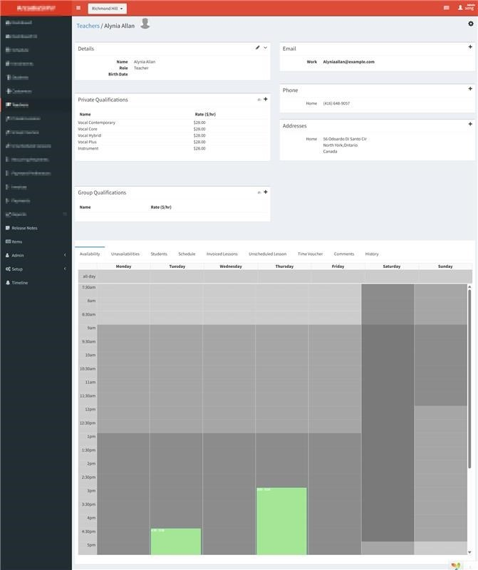
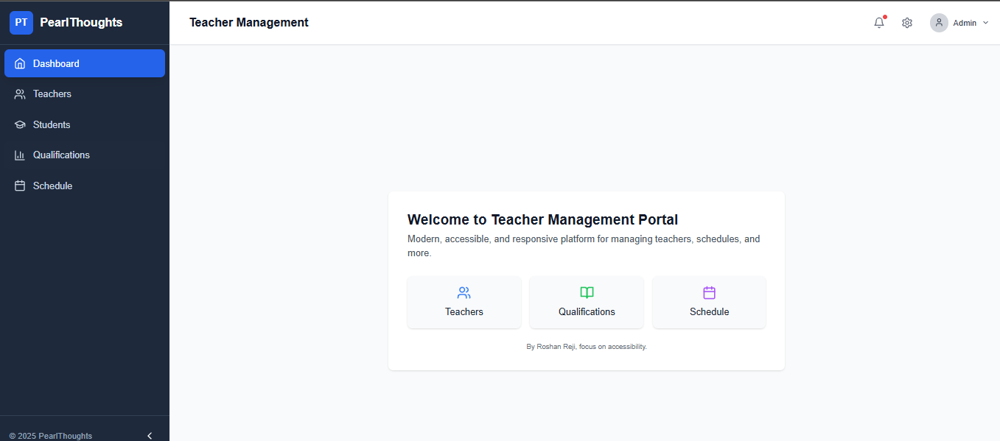
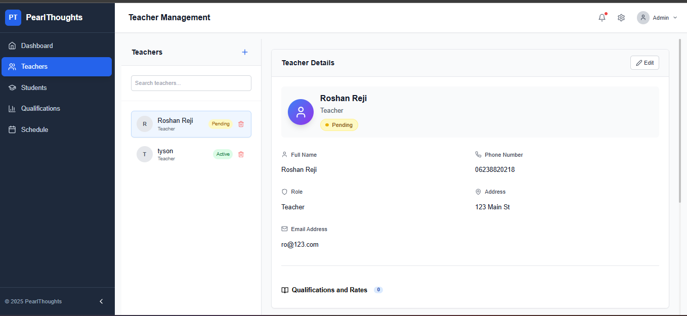
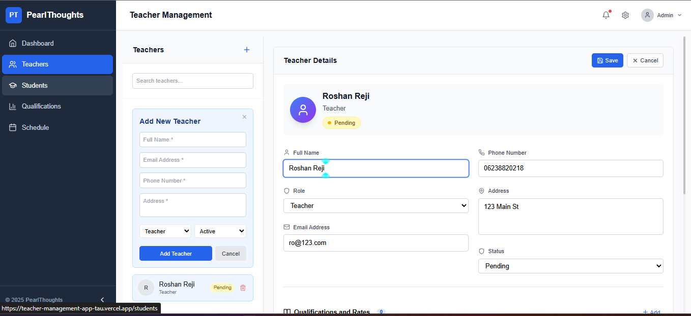
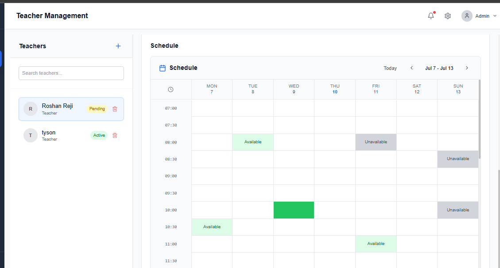

# 🏫 Teacher Management App

[Live Demo 🚀](https://teacher-management-app-tau.vercel.app/)
[GitHub Repository](https://github.com/Roshanbtech/teacher-management-app/)

A modern, responsive, and user-friendly application for managing teachers, schedules, and qualifications in schools or institutes.
Built with **Next.js**, **React**, **TypeScript**, and styled using **Tailwind CSS**.

---

## ✨ Features

* **Modern UI:** Clean, mobile-first interface for effortless navigation.
* **Teacher Management:** Add, edit, view, search, and delete teachers.
* **Profile Editing:** Quickly update teacher details and qualifications.
* **Advanced Calendar Grid:**

  * View and manage weekly teaching schedules.
  * Intuitive color-coded slots for Booked, Available, and Unavailable times.
  * Click to update slots instantly.
* **Instant Feedback:** Toast notifications for all major actions.
* **Accessibility:** WCAG-compliant for everyone.
* **Lightning Fast:** Powered by Next.js and Vercel.

---

## 📸 Screenshots

Below are key visuals of the app interface. All images are available in the `/public` directory.

| Task Image                   | Dashboard                          | Teachers                         | Actions                        | Calendar                         |
| ---------------------------- | ---------------------------------- | -------------------------------- | ------------------------------ | -------------------------------- |
|  |  |  |  |  |

---

## 🚀 Getting Started

Clone this repository and run it locally:

```bash
git clone https://github.com/Roshanbtech/teacher-management-app.git
cd teacher-management-app
npm install
npm run dev
```

Open [http://localhost:3000](http://localhost:3000) to view it in your browser.

---

## 🛠️ Tech Stack

* [Next.js](https://nextjs.org/)
* [React](https://react.dev/)
* [TypeScript](https://www.typescriptlang.org/)
* [Tailwind CSS](https://tailwindcss.com/)
* [Lucide Icons](https://lucide.dev/)
* [Vercel Hosting](https://vercel.com/)

---

## 📦 Project Structure

```
teacher-management-app/
├─ components/        # Reusable React components
├─ pages/             # Next.js pages
├─ public/            # Static assets (screenshots, icons, etc.)
├─ styles/            # Tailwind and global CSS
├─ utils/             # Utility helpers
├─ validations/       # Validation schemas
├─ hooks/             # Custom React hooks
├─ types/             # TypeScript types & interfaces
└─ ...                # Other configs
```

---

## 🧑‍💻 Contributing

Contributions are welcome!
Feel free to fork the repo, open issues, or submit pull requests.
For significant changes, please open an issue first to discuss your ideas.

---

## 📄 License

This project is licensed under the [MIT License](LICENSE).

---

## 🙏 Acknowledgements

Thanks to all open-source contributors and the Next.js, React, and Tailwind CSS communities!

---

## ⭐ Demo

Check out the live demo: [teacher-management-app-tau.vercel.app](https://teacher-management-app-tau.vercel.app/)
